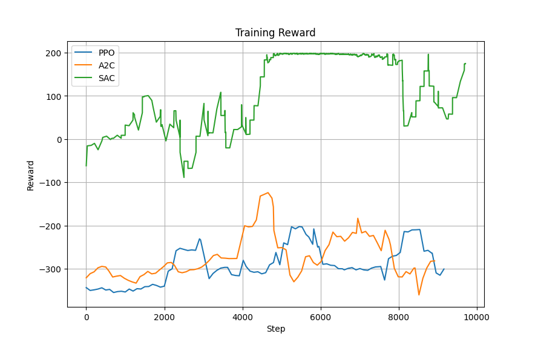

# UR5 Pick-and-Place Environment with PyBullet for Reinforcement Learning

🎥 **Result showcase**

- **Before Training (SAC - Initial)**  
  

- **After Training (SAC - Success)**  
  


---

## 🚀 Project Description

This project is a custom OpenAI Gym-compatible environment designed for simulating a UR5 robotic arm with a Robotiq 2F-85 gripper using PyBullet. The environment enables training and testing reinforcement learning algorithms for a basic pick-and-place task in a 3D physics-based simulation.

The environment simulates a UR5 arm equipped with a Robotiq gripper, interacting in a workspace with:
- A table
- A tray
- A blue cube to be picked

The agent learns to move the end-effector to the correct [x, y] position above a cube and perform a successful grasp using inverse kinematics and simulated gripper control.

**Key features:**
- Custom action and observation spaces
- Realistic physics-based control using PyBullet
- Visual debug lines and success messages
- Randomized cube positions at every reset
- Reward shaping to encourage faster, successful grasping

---

## ⚙️ Environment Details

- **Action Space**:  
  Continuous control of the target end-effector [x, y] position. (z is fixed)

- **Observation Space**:  
  The [x, y] position of the target cube.

- **Reward Function**:  
  - Positive reward for successful pick
  - Bonus for faster completion
  - Negative reward for failure or taking too many steps

- **Episode Termination**:
  - Cube picked successfully
  - Max steps reached

---


## 🧠 Algorithms Used

We tested and compared the performance of three reinforcement learning algorithms using Stable-Baselines3:

- **Soft Actor-Critic (SAC)** ✅ *Best Performance*
- **Proximal Policy Optimization (PPO)**
- **Advantage Actor-Critic (A2C)**

Among these, SAC consistently achieved higher success rates and faster convergence. It was more stable and sample-efficient for this continuous control task.

**Performance Summary:**

| Algorithm | Success Rate | Convergence Speed | Notes                        |
|-----------|--------------|-------------------|------------------------------|
| SAC       | ⭐ High      | ⭐ Fast            | Best overall performance     |
| PPO       | Medium      | Medium            | Stable, but slower to learn  |
| A2C       | Low         | Slow              | Less suitable for this task  |

Below is a comparison of the training reward progress for each algorithm. SAC shows the best performance in terms of higher rewards and faster convergence.



---


## 🤖 Dependencies

To run the project, install the following dependencies:

```bash
pip install stable-baselines3
pip install pybullet
pip install numpy
pip install matplotlib
```

---


## 🚀 Usage

### ✅ Train the Model

```bash
# Uncomment train_algo() in the main() function in main_rl.py to start training
python main_rl.py
During training, the model will be automatically saved to ./models/, and logs will be recorded in ./logs/.
```

### 🧪 Test the Model

```bash
# test_algo() in main_rl.py is set by default to run the test
python main_rl.py
Make sure that a trained model is available in the ./models/ directory, and modify the model name accordingly to load it.
```

### 📈 Additional Feature - Reward Graph Plotting

The main_rl.py script provides the plot_reward_data() function to visualize reward changes:

```python
# Uncomment plot_reward_data() at the bottom of main_rl.py
plot_reward_data()
```

This will display the training trend graphs for each algorithm.


## 🤖 Resources & References

- **PyBullet**: PyBullet is a physics engine for simulating robots and their environments. You can find more details and documentation on the official website of [PyBullet](https://pybullet.org/).
-  **Model**: https://github.com/ElectronicElephant/pybullet_ur5_robotiq


